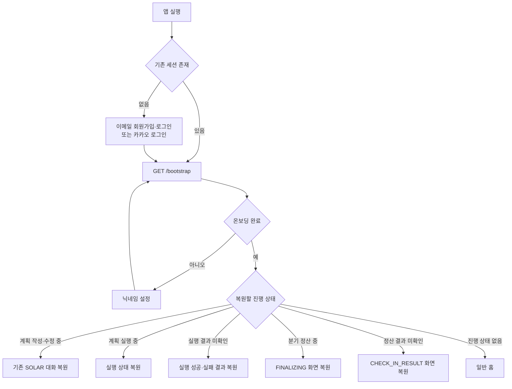
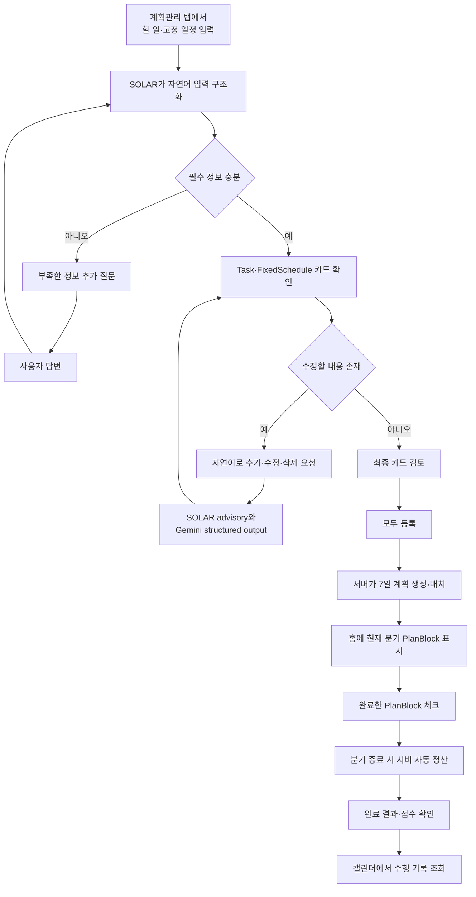
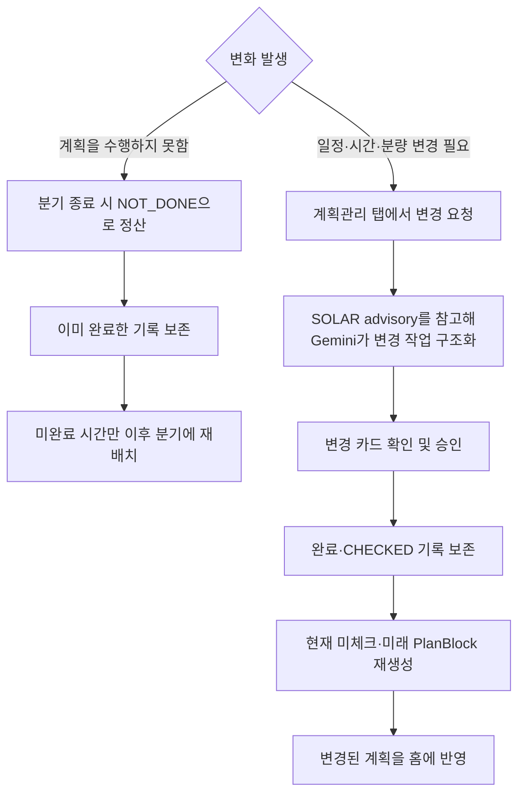
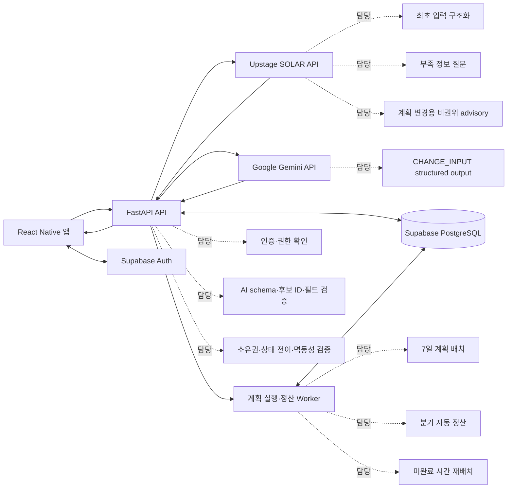

# 이음 (E-um)

> **오늘의 나에게 맞춰 이어지는 계획, 이음**

이음은 사용자가 해야 할 일과 고정 일정을 대화로 전달하면,
**Upstage SOLAR**가 최초 입력을 Task와 FixedSchedule로 구조화하고 부족한 정보를 질문합니다.
진행 중인 계획의 변경 요청은 SOLAR의 참고 분석과 **Google Gemini**의 구조화된 결과를 통해 처리합니다.

FastAPI는 AI 출력을 검증하고, Worker와 스케줄러는 검증된 Task를 실행 단위로 나누어
오전·오후·저녁 단위의 7일 계획으로 배치합니다.

계획이 어긋나도 이미 완료한 기록은 보존하고,
미완료된 시간만 이후 일정에 다시 연결합니다.

---

## 바로가기

- **GitHub 저장소**: https://github.com/nanman0620/AI-Builder-Sprint
- **Android APK 다운로드**: https://expo.dev/accounts/jennishin/projects/AI-Builder-Sprint/builds/b3360000-acde-455e-a3b8-1312a22b3073
- **시연 영상**: https://drive.google.com/file/d/1gdvrxNTZpPp7i6Siyy1aKHB1czsb9hrw/view?usp=sharing
- **백엔드 배포 주소**: https://ieum-api-2oa0.onrender.com
- **Health Check**: https://ieum-api-2oa0.onrender.com/api/v1/health
- **API 문서**: https://ieum-api-2oa0.onrender.com/docs

> Render 무료 인스턴스 특성상 일정 시간 요청이 없으면 첫 요청에 수십 초가 걸릴 수 있습니다.

---

## 1. 문제 정의

대학생은 과제, 수업, 팀 프로젝트와 같은 여러 일정을 동시에 관리해야 하지만, 크고 막막해 보이는 일은 어디서부터 시작해야 할지 판단하기 어려워 미루기 쉽습니다. 고정 일정과 가용 시간을 함께 고려해 계획을 세우는 과정도 번거롭고, 한 작업이 예상보다 늦어지면 이후 계획 전체를 직접 다시 조정해야 합니다.

더 큰 문제는 작은 미완료가 하루 전체의 실패처럼 느껴진다는 점입니다. 계획 하나를 지키지 못하면 “오늘 계획은 이미 망했다”고 생각하며, 아직 수행할 수 있는 남은 계획까지 포기하거나 플래너 사용 자체를 중단하기 쉽습니다.

기존 일정 관리 서비스는 해야 할 일을 나열하고 완료 여부를 기록하는 데 그치는 경우가 많습니다. 부담스러운 일을 지금 시작할 수 있는 단위로 나누거나, 이미 해낸 부분은 보존하면서 미완료된 부분만 다시 조정해 주지는 않습니다.

이음은 큰 과제를 실행 가능한 작은 계획으로 나누어 시작의 부담을 낮춥니다. 또한 계획이 어긋나더라도 사용자가 해낸 만큼은 성과로 인정하고, 미완료된 시간만 같은 7일 계획의 이후 일정으로 다시 이어줍니다. 이를 통해 계획을 한 번 생성하는 데서 끝나지 않고, 실행 중 발생한 변화까지 반영해 사용자가 다음 행동을 계속 이어갈 수 있도록 돕는 것을 목표로 합니다.

### 주요 사용자

과제, 수업, 팀 프로젝트, 아르바이트처럼
마감이 있는 일과 고정 일정을 함께 관리해야 하지만,
계획이 한 번 어긋나면 남은 일정을 다시 짜는 데 부담을 느끼는 대학생

---

## 2. 해결 방식

이음은 사용자의 입력을 다음 흐름으로 처리합니다.

1. 사용자가 할 일의 마감·예상 시간·분량과 고정 일정을 대화로 입력
2. SOLAR가 최초 입력을 Task와 FixedSchedule로 구조화하고, 필요한 정보가 부족하면 추가 질문
3. 진행 중 계획을 변경할 때는 SOLAR의 참고 분석과 Gemini의 구조화된 결과로 추가·수정·삭제 요청을 해석
4. FastAPI가 AI 응답 형식, 변경 대상, 허용 필드, 소유권과 상태 전이를 검증
5. Worker와 스케줄러가 고정 일정과 남은 시간을 고려해 오전·오후·저녁 단위의 7일 PlanBlock으로 배치
6. 사용자는 홈에서 현재 분기의 PlanBlock을 확인하고 완료한 항목을 체크
7. 분기 종료 시 서버가 내부 CheckIn을 생성해 완료 여부를 자동 정산
8. 이미 완료한 기록은 보존하고, 미완료된 시간만 같은 7일 계획의 이후 분기에 재배치
9. 사용자는 정산 결과와 캘린더에서 수행 기록을 확인

---

## 3. 핵심 기능

### 인증 및 온보딩

- 이메일 회원가입·로그인
- 카카오 소셜 로그인
- Supabase Auth 기반 세션 유지
- 닉네임 및 초기 사용자 정보 저장
- 로그아웃 및 실제 회원탈퇴
  - 사용자 앱 데이터 삭제
  - Supabase Auth 사용자 삭제
  - 앱 재실행 후 삭제된 세션이 복원되지 않도록 로컬 세션 정리

### AI 기반 계획 구조화 및 생성

- 자연어로 할 일과 일정 입력
- 정보 부족 시 추가 질문
- 서버 스케줄러가 고정 일정을 제외한 남은 시간에 실행 계획 배치
- 생성 결과 확인 및 승인
- 승인된 계획을 홈 화면에 반영

### 미완료 계획 자동 재배치

- 분기 종료 시 수행하지 못한 PlanBlock을 자동 정산
- 이미 완료한 PlanBlock과 과거 수행 기록 보존
- 미완료된 시간만 같은 7일 계획의 이후 분기에 재배치
- 사용자가 계획 전체를 처음부터 다시 작성하지 않아도 다음 행동을 이어갈 수 있도록 지원

### 대화형 계획 변경

- 진행 중인 계획의 추가·수정·삭제 요청을 자연어로 입력
- AI가 변경 대상을 찾고 변경 내용을 카드로 구조화
- 사용자가 실제 반영될 변경 카드를 최종 확인
- 시간·분량·마감·고정 일정의 변경 사항 반영
- 과거 완료 기록과 현재 `CHECKED` PlanBlock은 보존
- 아직 수행하지 않은 현재·미래 PlanBlock만 다시 배치

### 실행 및 기록

- 현재 시간대에 해당하는 PlanBlock 조회
- 완료한 PlanBlock 체크 및 체크 해제
- 분기 종료 시 서버 자동 정산
- 완료율 구간에 따른 결과 점수와 피드백 제공
- 완료한 기록을 보존하고 미완료 시간을 이후 분기에 재배치
- 캘린더에서 날짜별 수행 기록과 과거 점수 조회

---

## 4. 사용자 흐름

사용자 흐름은 **앱 진입 및 상태 복원**과 **계획 생성·실행·재계획**으로 나뉩니다.

### 4.1 앱 진입 및 상태 복원



앱을 다시 실행해도 작성 중인 대화, 계획 실행 상태, 분기 정산 결과를 서버 상태에 따라 이어서 확인할 수 있습니다.

### 4.2 계획 생성 및 실행



### 4.3 계획이 어긋났을 때



핵심은 계획이 어긋나더라도 모든 일정을 처음부터 다시 만드는 것이 아니라, **이미 완료한 기록은 보존하고 아직 수행하지 않은 부분만 다시 이어주는 것**입니다.

---

## 5. AI와 백엔드의 역할 분리



모바일 앱은 Supabase Auth를 통해 인증하고, 서비스 데이터의 조회와 변경은 FastAPI를 통해 수행합니다.

최초 계획 수집에서는 SOLAR가 자연어를 Task와 FixedSchedule로 구조화하고 부족한 정보를 질문합니다. 진행 중 계획의 `CHANGE_INPUT`에서는 SOLAR가 후보 문맥을 바탕으로 비권위 advisory를 만들고, Gemini가 추가·수정·삭제 작업의 structured output을 생성합니다.

AI 응답은 데이터베이스에 곧바로 저장되지 않습니다. FastAPI가 schema, 후보 ID, `updateFields`, 날짜·시간, 대상 소유권과 현재 상태를 검증합니다.

검증된 요청만 Worker가 실제 계획으로 배치하거나 수정합니다. 계획 실행, 분기 자동 정산, 미완료 시간 재배치는 결정적인 서버 로직이 담당합니다.

### 주요 예외 처리와 안전장치

| 상황 | 처리 방식 |
|---|---|
| AI 응답이 계약된 JSON 구조와 다름 | 허용된 범위만 제한적으로 보정하고 최대 1회 다시 요청한 뒤, 계속 실패하면 저장하지 않고 안전하게 오류 반환 |
| 동일 메시지가 다시 전송됨 | 클라이언트 이벤트 식별자와 요청 내용을 기준으로 중복 저장 방지 |
| 계획 실행 요청이 중복됨 | Idempotency Key와 상태 조건부 갱신으로 동일 실행의 중복 등록 방지 |
| 계획 실행 중 예외 발생 | 실행 트랜잭션 전체 rollback 후 별도 트랜잭션에서 안전한 실패 상태 기록 |
| 실행 상태 조회 중 네트워크 오류 발생 | 실제 실행 실패로 변경하지 않고 기존 실행 상태를 유지한 채 재조회 안내 |
| 앱 종료 또는 백그라운드 이동 | 서버에 저장된 요청·실행·정산 상태를 `GET /bootstrap`으로 복원 |
| 종료된 분기의 PlanBlock을 체크함 | optimistic 변경을 되돌리고 최신 홈 상태 재조회 |
| 진행 중 계획을 수정함 | 과거 완료 기록과 현재 체크한 PlanBlock은 보존하고 미체크·미래 계획만 재생성 |
| 회원탈퇴 요청 | 앱 데이터 삭제, Supabase Auth 사용자 삭제, 모바일 세션과 로컬 상태 초기화 |

---

## 6. 기술 스택

| 영역 | 기술 |
|---|---|
| Mobile | React Native, Expo, Expo Router, TypeScript |
| Backend | FastAPI, Python |
| ORM / Migration | SQLAlchemy, Alembic |
| Database | PostgreSQL, Supabase PostgreSQL |
| Authentication | Supabase Auth |
| AI | Upstage SOLAR API, Google Gemini API |
| Deployment | Render |
| Android Build | EAS Build |
| Collaboration | GitHub Issues, Pull Requests, Claude Code, Codex |

### 실제 검증 환경

- 서버 요구 버전: Python `>= 3.13` (`apps/server/pyproject.toml`)
- Expo SDK: `54`
- React Native: `0.81.5`
- React: `19.1.0`
- TypeScript: `package.json` 요구 범위 `~5.9.2`, `package-lock.json` 해석 버전 `5.9.3`
- Android 애플리케이션 ID: `com.jennishin.ieum`

---

## 7. 저장소 구조

```text
AI-Builder-Sprint/
├─ apps/
│  ├─ mobile/
│  │  ├─ app/          # Expo Router Route
│  │  ├─ src/          # 기능·컴포넌트·API client
│  │  └─ assets/       # 앱 runtime 이미지·폰트
│  └─ server/
│     ├─ app/          # FastAPI·service·Worker
│     ├─ alembic/      # DB migration
│     └─ tests/        # 서버 테스트
├─ docs/
│  ├─ api/             # 최종 API 명세
│  ├─ database/        # 최종 DB 명세와 ERD
│  ├─ design/          # 화면 흐름·UI 구현 기준
│  └─ ai/              # AI 활용 기록과 구현 컨텍스트
├─ .github/            # Issue·PR 템플릿
├─ AGENTS.md           # Codex 작업 지침
├─ CLAUDE.md           # Claude Code 작업 지침
└─ README.md
```

---

## 8. Android APK 설치 및 실행

### 지원 환경

- Android용 APK 제공
- iOS 설치 파일은 이번 MVP 제출 범위에 포함하지 않음
- Play Store가 아닌 EAS Internal Distribution 방식으로 배포

### 설치 방법

1. 위의 **Android APK 다운로드** 링크를 열어 APK 파일을 내려받습니다.
2. 다운로드한 APK 파일을 열고 **설치**를 선택합니다.
3. 출처가 확인되지 않은 앱이라는 경고가 표시되면 **무시하고 설치**를 선택합니다.
4. Google Play Protect가 앱 설치를 차단하면 **세부정보** 또는 **자세히 보기**를 연 뒤 **무시하고 설치하기**를 선택합니다.
5. 설치가 완료되면 앱 이름 **이음**을 실행합니다.
6. 이메일 회원가입 또는 카카오 로그인을 진행합니다.
7. 신규 사용자는 닉네임 온보딩을 완료한 뒤 서비스를 사용할 수 있습니다.

> Android 제조사와 OS 버전에 따라 `무시하고 설치`, `세부정보`, `자세히 보기`, `설치하기` 등 버튼 이름이 다르게 표시될 수 있습니다.
> 이 경고는 앱이 Play Store가 아닌 APK 파일로 직접 배포되기 때문에 표시됩니다.

### 첫 실행 시 서버 준비 시간

앱 화면은 설치 후 바로 실행되지만, 백엔드는 Render 무료 인스턴스로 운영되어 일정 시간 요청이 없으면 일시 중지됩니다.

서버가 중지된 상태에서는 첫 회원가입 또는 로그인 요청에 수십 초에서 약 1분이 걸릴 수 있습니다.

1. 회원가입 또는 로그인 버튼을 누른 뒤 잠시 기다립니다.
2. 즉시 응답하지 않더라도 버튼을 여러 번 연속으로 누르지 않습니다.
3. 약 1분 뒤에도 진행되지 않으면 한 번 다시 시도합니다.
4. 필요하면 아래 Health Check 주소를 먼저 열어 서버를 시작한 뒤 앱으로 돌아옵니다.

- Health Check: https://ieum-api-2oa0.onrender.com/api/v1/health

### 테스트 계정

별도의 공용 테스트 계정 없이 다음 방식으로 바로 사용할 수 있습니다.

- 이메일로 신규 회원가입
- 카카오 소셜 로그인

---

## 9. 실행 및 개발 환경

### 권장 테스트 방법

> 본 프로젝트는 운영진 안내의 **①번 방식인 Android APK 다운로드 주소와 배포된 백엔드 주소**를 통해 심사를 지원합니다. 아래 로컬 실행 안내는 코드 검토와 개발을 위한 선택 사항이며, ②번 로컬 기동 방식으로 제출한 것이 아닙니다.

이음은 Supabase Auth·PostgreSQL, Upstage SOLAR, Google Gemini와 Render에 의존하므로 전체 기능을 새 로컬 환경에서 재현하려면 별도의 외부 서비스 설정이 필요합니다.

심사 시에는 상단의 **Android APK 다운로드 링크**를 통해 앱을 설치하고, 이미 배포된 백엔드를 이용해 주세요.

- Android APK: 상단 바로가기 참고
- Backend: https://ieum-api-2oa0.onrender.com
- Health Check: https://ieum-api-2oa0.onrender.com/api/v1/health
- API 문서: https://ieum-api-2oa0.onrender.com/docs

> 백엔드는 Render 무료 인스턴스로 배포되어 있습니다. 앱 화면은 바로 실행되지만, 서버가 유휴 상태였다면 첫 회원가입·로그인 요청에 수십 초에서 약 1분이 걸릴 수 있습니다. 잠시 기다린 뒤 한 번 다시 시도하거나 Health Check 주소를 먼저 열어 주세요.

### 개발용 로컬 실행

로컬 실행은 코드 검토와 개발을 위한 선택 사항입니다. 전체 기능을 사용하려면 별도의 Supabase 프로젝트와 Gemini API Key 등이 필요합니다.

별도의 로컬 재현이 필요한 경우 운영진 요청에 따라 테스트용 환경과 추가 안내를 제공하겠습니다.

저장소를 복제합니다.

```bash
git clone https://github.com/nanman0620/AI-Builder-Sprint.git
cd AI-Builder-Sprint
```

백엔드·모바일·테스트 절의 첫 `cd` 명령은 현재 위치와 관계없이 저장소 루트를 기준으로 이동합니다. 가상환경 활성화처럼 같은 절에서 이어지는 명령은 직전 단계의 디렉터리에서 실행합니다.

로컬 실행 전 Python 3.13과 Node.js·npm이 설치되어 있어야 합니다. Python 3.13이 설치되어 있지 않다면 운영체제에 맞는 방법으로 먼저 설치해 주세요. Android 실행에는 Android Studio Emulator 또는 USB 디버깅이 연결된 Android 기기가 필요합니다. macOS / Linux / WSL에서는 가상환경을 만들기 전에 다음 명령으로 필수 도구를 확인합니다.

> WSL에서 실행하는 경우 Node.js와 npm도 WSL 내부에 설치해야 합니다. `node -p "process.platform"`의 결과가 `linux`인지 확인해 주세요.
```bash
python3.13 --version
node --version
npm --version
```

### 백엔드 가상환경 생성 및 개발 의존성 설치

Windows PowerShell:

```powershell
Set-Location (Join-Path (git rev-parse --show-toplevel) "apps/server")
py -3.13 -m venv .venv
.\.venv\Scripts\Activate.ps1
python -m pip install --upgrade pip
python -m pip install -e ".[dev]"
if (-not (Test-Path .env)) { Copy-Item .env.example .env }
```

macOS / Linux:

```bash
cd "$(git rev-parse --show-toplevel)/apps/server"
python3.13 -m venv .venv
source .venv/bin/activate
python -m pip install --upgrade pip
python -m pip install -e ".[dev]"
test -f .env || cp .env.example .env
```

`apps/server/.env`에 아래 서버 환경변수를 설정한 뒤 migration과 서버를 실행합니다. Uvicorn은 실행 상태를 유지하므로 모바일은 별도 터미널에서 시작합니다.

```bash
python -m alembic upgrade head
python -m uvicorn app.main:app --reload --host 0.0.0.0 --port 8000
```

서버가 실행되면 다음 주소를 확인할 수 있습니다.

- Health Check: http://127.0.0.1:8000/api/v1/health
- API 문서: http://127.0.0.1:8000/docs

#### 모바일

Windows PowerShell:

```powershell
Set-Location (Join-Path (git rev-parse --show-toplevel) "apps/mobile")
npm install
if (-not (Test-Path .env)) { Copy-Item .env.example .env }
```

macOS / Linux / WSL:

```bash
cd "$(git rev-parse --show-toplevel)/apps/mobile"
npm install
test -f .env || cp .env.example .env
```

`apps/mobile/.env`에 세 모바일 환경변수를 설정합니다. `EXPO_PUBLIC_API_BASE_URL`은 반드시 `/api/v1`까지 포함해야 합니다.

- Web: `http://127.0.0.1:8000/api/v1`
- Android emulator: `http://10.0.2.2:8000/api/v1`
- 실제 Android 기기: `http://<개발 PC의 LAN-IP>:8000/api/v1`

실제 기기와 개발 PC는 같은 네트워크에 연결되어 있어야 하며, 백엔드는 위 명령처럼 `0.0.0.0`에서 요청을 수신해야 합니다.

Expo 개발 서버:

```bash
npx expo start -c
```

Android 실행:

```bash
npm run android
```

`npx expo start -c`와 `npm run android`는 각각 개발 서버를 시작하는 명령이므로 필요한 실행 방식 하나를 선택합니다.

필요한 환경변수 이름과 설명은 다음 예시 파일에서 확인할 수 있습니다.

- [`apps/server/.env.example`](./apps/server/.env.example)
- [`apps/mobile/.env.example`](./apps/mobile/.env.example)

서버 주요 환경변수:

- `DATABASE_URL`, `SUPABASE_URL`, `SOLAR_API_KEY`, `SOLAR_BASE_URL`, `SOLAR_MODEL`
- `GEMINI_API_KEY`, `GEMINI_MODEL`, `SUPABASE_SERVICE_ROLE_KEY`

모바일 환경변수:

- `EXPO_PUBLIC_SUPABASE_URL`, `EXPO_PUBLIC_SUPABASE_ANON_KEY`, `EXPO_PUBLIC_API_BASE_URL`

위 변수는 개발용 로컬 실행에 필요한 설정입니다. 심사 권장 경로인 배포 APK 이용 시 심사위원이 별도의 API Key를 설정할 필요가 없습니다. 서버 Secret은 모바일 앱이나 Git 저장소에 포함하지 않습니다.

### 개발용 웹 프리뷰

```bash
cd "$(git rev-parse --show-toplevel)/apps/mobile"
npm run web
```

> 웹은 UI·라우팅·정적 export 확인을 위한 개발용 프리뷰입니다. 최종 지원 및 제출 환경은 Android APK입니다.

---

## 10. 배포 환경

### Backend

- 서비스: Render Web Service
- Root Directory: `apps/server`
- Build Command:

```bash
python -m pip install --upgrade pip && python -m pip install .
```

- Start Command:

```bash
uvicorn app.main:app --host 0.0.0.0 --port $PORT
```

- 공개 주소: https://ieum-api-2oa0.onrender.com
- Health Check: https://ieum-api-2oa0.onrender.com/api/v1/health
- API 문서: https://ieum-api-2oa0.onrender.com/docs

> Render 루트 `/`에는 별도 페이지가 없습니다. 서버 상태는 Health Check와 API 문서 주소에서 확인합니다.

### Mobile

- 빌드: EAS Build
- 프로필: `preview`
- 배포 방식: Internal Distribution
- 결과물: Android APK
- EAS 환경: `preview`

---

## 11. 테스트 및 검증 결과

### 서버 자동 테스트

Windows PowerShell:

```powershell
Set-Location (Join-Path (git rev-parse --show-toplevel) "apps/server")
python -m pytest -q
```

macOS / Linux / WSL:

```bash
cd "$(git rev-parse --show-toplevel)/apps/server"
python -m pytest -q
```

- 서버 테스트: **1032 passed**
- AI 응답 계약과 오류 거부 경로 검증
- 계획 생성·변경·재배치 Worker 검증
- 멱등성, rollback, 상태 전이 검증
- PlanBlock 배치와 분량 분배 경계값 검증
- 분기 자동 정산과 홈·캘린더 조회 기준 검증
- 회원탈퇴 삭제 순서와 연관 데이터 정리 검증

### 모바일 정적 검사

Windows PowerShell:

```powershell
Set-Location (Join-Path (git rev-parse --show-toplevel) "apps/mobile")
npx tsc --noEmit
npm run lint
```

macOS / Linux / WSL:

```bash
cd "$(git rev-parse --show-toplevel)/apps/mobile"
npx tsc --noEmit
npm run lint
```

- TypeScript 검사 통과
- ESLint 통과
- 개발 과정에서 Expo Web 정적 export 확인

> 모바일 `package.json`에는 공용 `test` script가 없습니다. 저장소의 기능별 테스트 파일은 개발 과정의 일회성 Node 하네스로 검증했으며, 현재 새 환경에서 재현 가능한 공통 검증 명령은 위 TypeScript 검사와 ESLint입니다. React Native 의존 동작은 Expo Web 정적 export와 Android 실기기 검증으로 보완했습니다.

### 실제 환경 통합 검증

- Android 기기에서 EAS APK 설치 및 실행
- 이메일 회원가입·로그인과 카카오 로그인
- 온보딩, 자연어 계획 생성, 추가 질문, 홈 반영
- 계획 추가·수정·삭제와 미완료 시간 재배치
- 완료 체크, 자동 정산 결과, 캘린더 조회
- Render·Supabase·Upstage SOLAR 연동
- 실제 Supabase 환경에서 회원탈퇴 및 세션 미복원 확인

### 검증 범위

잠금 순서, 조건부 상태 전이와 rollback은 자동 테스트로 검증했습니다. 회원탈퇴는 실제 Supabase 프로젝트에서 추가 검증했으며, 여러 서버 프로세스를 사용한 부하·경합 테스트는 수행하지 않았습니다.

---

## 12. AI 활용

이 프로젝트는 AI를 단순 코드 생성기가 아니라 **계획 수립, 구현, 검토, 테스트 설계와 실제 검증을 반복하는 개발 도구**로 활용했습니다.

### 서비스 내 AI

#### Upstage SOLAR

- 최초 사용자 입력에서 Task와 FixedSchedule 구조화
- 제목·마감·예상 시간·분량을 서로 다른 필드로 분리
- 정보가 부족한 항목에 대한 추가 질문 생성
- 질문에 대한 사용자 답변 해석
- 진행 중 계획의 변경 분석을 위한 비권위 advisory 생성

#### Google Gemini

- `CHANGE_INPUT` 단계에서 structured output 생성
- 진행 중 계획의 추가·수정·삭제 요청 구조화
- 변경 대상이나 내용이 모호한 경우 후속 확인에 필요한 정보 생성

AI가 실제 계획 데이터를 직접 수정하지는 않습니다. FastAPI가 schema, 후보 ID, `updateFields`, 대상 소유권과 상태 전이를 검증하고, 검증된 요청만 Worker가 반영합니다. 실제 7일 PlanBlock 배치, 실행, 분기 자동 정산과 미완료 시간 재배치는 Worker와 scheduler가 담당합니다.

### 개발 과정의 AI

- Claude Code 및 Codex를 활용한 구현 계획 수립
- 구현 계획에 대한 반복 검토와 반려
- API·DB·화면 흐름 정합성 확인
- 예외처리와 동시성 위험 검토
- 단위 테스트 및 실제 Supabase 검증 시나리오 설계
- Pull Request 단위 변경과 검증 결과 기록

### AI 활용 증빙

- [SOLAR prompt·parser·repair 및 CHANGE_INPUT orchestration](./apps/server/app/services/solar_client.py)
- [Gemini structured output API client](./apps/server/app/services/gemini_change_input_client.py)
- [AI 모델·환경변수 설정](./apps/server/app/core/config.py)
- [`CLAUDE.md`](./CLAUDE.md)
- [`AGENTS.md`](./AGENTS.md)
- [`docs/ai/AI_USAGE_LOG.md`](./docs/ai/AI_USAGE_LOG.md)
- [`docs/ai/IMPLEMENTATION_CONTEXT.md`](./docs/ai/IMPLEMENTATION_CONTEXT.md)

AI의 제안을 그대로 반영하지 않고, 사람이 구현 범위와 위험을 검토한 뒤 수정·승인했습니다.

---

## 13. 알려진 제한 사항

### 지원 환경

- 최종 지원 환경은 Android APK입니다.
- iOS 설치 파일은 이번 MVP 제출 범위에 포함하지 않습니다.
- 웹 실행은 UI 개발과 정적 검증을 위한 프리뷰 용도입니다.

### 계획 기능

- 반복 Task와 반복 고정 일정은 지원하지 않습니다. 반복 Task가 감지되면 이번 7일의 전체 분량과 총 예상 시간을 다시 질문합니다.
- PDF·이미지·문서 업로드를 통한 일정 자동 추출은 지원하지 않습니다.
- 캘린더는 조회 전용이며, 계획의 추가·수정·삭제는 계획관리 탭의 대화를 통해 수행합니다.
- 진행 중인 7일 계획을 강제로 교체하지 않으며, 완료 기록을 보존하고 아직 수행하지 않은 계획만 수정·재배치합니다.

### 계정 기능

- 회원가입, 로그인, 로그아웃과 회원탈퇴를 지원합니다.
- 비밀번호 변경 기능은 이번 MVP 범위에 포함하지 않습니다.
- 회원탈퇴는 이음 서비스의 앱 데이터와 Supabase Auth 사용자를 삭제합니다.
- 카카오 제공자 계정 자체의 연결 해제 API는 이번 MVP 범위에 포함하지 않습니다.

### 실행 환경

- Render 무료 인스턴스는 비활성 상태 이후 첫 요청이 느릴 수 있습니다.
- 동시에 충돌하는 계획 변경이나 실행 요청은 DB 잠금과 조건부 상태 갱신으로 보호합니다.
- 경합이 감지된 일부 요청은 데이터를 부분 반영하지 않고 안전하게 실패하며, 사용자가 다시 시도할 수 있습니다.

---

## 14. 보안 주의사항

- `.env` 파일은 Git에 커밋하지 않습니다.
- `SUPABASE_SERVICE_ROLE_KEY`는 서버 환경에서만 사용합니다.
- `DATABASE_URL`, SOLAR/Gemini API Key는 서버 Secret으로 관리합니다.
- 모바일에는 `EXPO_PUBLIC_*` 공개 설정만 포함합니다.
- 실제 Secret과 개인 테스트 계정 정보는 저장소에 포함하지 않았습니다.
